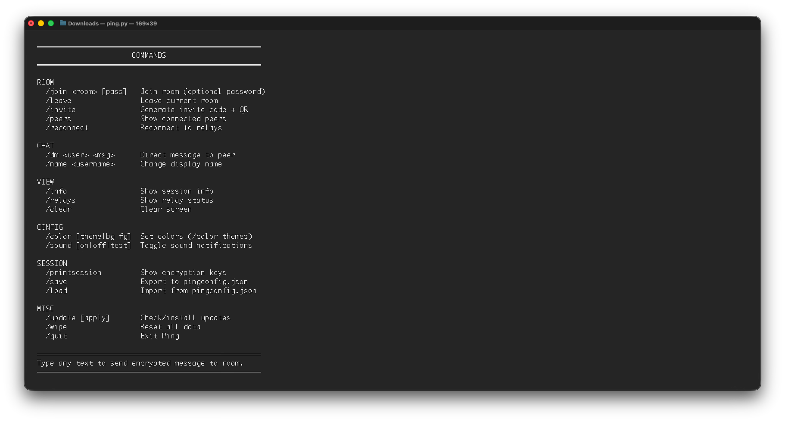
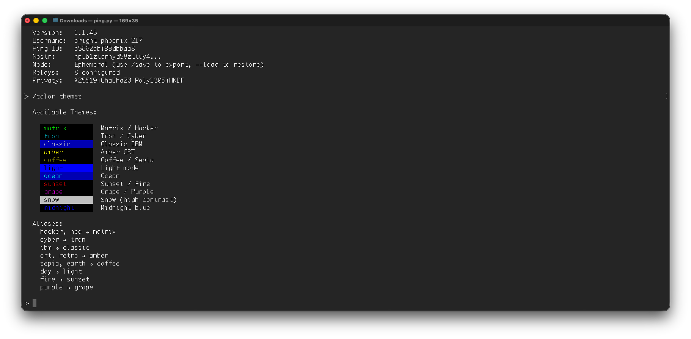

<div align="center">

# 🏓 Ping

**Decentralized End-to-End Encrypted Messenger**


*Serverless, Trustless, Attacless Private Messaging.*


</div>

---

## 📑 Table of Contents

- [✨ Features](#-features)
- [🛡️ Security](#️-security)
- [📦 Installation](#-installation)
- [🚀 Usage](#-usage)
- [🎨 Themes](#-themes)
- [💾 Session Management](#-session-management)
- [🔄 Updates](#-updates)
- [📱 Ping on Mobile](#-ping-on-mobile)
- [🌐 How It Works](#-how-it-works)
- [🤝 Contributing](#-contributing)
- [📄 License](#-license)
- [🙏 Acknowledgments](#-acknowledgments)

---

## ✨ Features

### 🔒 Privacy First
- **End-to-end encryption** with X25519 + ChaCha20-Poly1305
- **Ephemeral chat sessions** - new keys each session by default
- **No accounts** - no email, no phone, no registration
- **No metadata** - encrypted envelopes hide message patterns
- **Memory only** - Runs by default in memory-only mode without session history

### 🌐 Truly Decentralized
- **Nostr protocol** - censorship-resistant relay network
- **No central server** - messages route through public relays
- **Works offline-first** - reconnects automatically
- **Self-hosted option** - run your own relay

### 💬 Full-Featured
- **Room-based** group chats
- **Direct messages** between peers
- **Password-protected** rooms
- **Invite codes** with QR generation
- **Sound notifications** with mention detection
- **Exportable sessions** - sessions can be saved/loaded from local storage

### 🎨 Customizable
- **20+ color themes** (matrix, tron, amber, etc.)
- **Custom colors** - set any bg/fg combination
- **Portable** - single Python file, no install needed
- **Cross-platform** - Linux, macOS, Windows, mobile

---

## 🛡️ Security

Ping uses a modern cryptographic stack:

| Layer | Algorithm | Purpose |
|-------|-----------|---------|
| Key Exchange | **X25519 ECDH** | Derive shared secrets |
| Encryption | **ChaCha20-Poly1305** | Authenticated encryption |
| Key Derivation | **HKDF-SHA256** | Expand shared secret |
| Nostr Identity | **secp256k1 Schnorr** | Sign Nostr events |

### Privacy Modes

| Mode | Flag | Protection Level |
|------|------|------------------|
| **Default** | - | Encrypted envelopes + ephemeral Nostr keys |
| **Hardened** | `--hardened` | Default + decoy traffic + timing jitter |
| **Legacy** | `--legacy` | E2E encryption only |

---

## 📦 Installation

### Prerequisites

- Python 3.12 or higher
- pip (Python package manager)

### Quick Install

```bash
# Clone the repository
git clone https://github.com/attacless/ping.git
cd ping

# Install dependencies
pip install cryptography websockets certifi

# Optional: faster crypto (recommended)
pip install secp256k1
# or
pip install coincurve

# Optional: QR code generation
pip install qrcode
```

### One-Line Install

```bash
curl -O https://raw.githubusercontent.com/attacless/ping/main/ping.py && pip install cryptography websockets certifi && python ping.py
```

### Debian/Ubuntu/Tails/Mint
```bash
# Clone the repository
git clone https://github.com/attacless/ping.git
cd ping

#Install pip
sudo apt install python3-pip

#Install dependecies
sudo apt install python3-cryptography python3-websockets python3-certifi

#Install optional dependencies
sudo apt install python3-coincurve python3-secp256k1

# Optional: QR code generation
sudo apt install qrcode
```

### CentOS/Fedora/RHEL
```bash
#Install pip
sudo yum install python-pip

#Install required packages
pip install cryptography websockets certifi

#Install optional packages
pip install coincurve secp256k1

#Install optional QR code library
pip install qrcode
```

### Android (Termux)
```bash
#Install python
pkg install python

#Download
curl -O https://raw.githubusercontent.com/attacless/ping/main/ping.py

#Make file executable
chmod +x ping.py

#Export ANDROID_API_LEVEL
export ANDROID_API_LEVEL=$(getprop ro.build.version.sdk)

#Install rust
pkg install rust

#Install cryptography
pip install cryptography websockets certifi
```

# iPhone (a-Shell mini)
```bash
#Install dependencies
pip3 install cryptography websockets certifi

#Download
curl -O https://raw.githubusercontent.com/attacless/ping/main/ping.py

#Make file executable
chmod +x ping.py
```


### Dependencies

| Package | Required | Purpose |
|---------|----------|---------|
| `cryptography` | ✅ Yes | X25519, ChaCha20-Poly1305, HKDF |
| `websockets` | ✅ Yes | Nostr relay connections |
| `certifi` | ✅ Yes | SSL certificates |
| `secp256k1` | ⭐ Recommended | Fast Schnorr signatures |
| `coincurve` | 🔄 Alternative | Schnorr signatures |
| `qrcode` | 📱 Optional | QR invite codes |

> **Note:** If neither `secp256k1` nor `coincurve` is installed, Ping falls back to a pure Python implementation (slower but works everywhere).

---

## 🚀 Usage

### Basic Usage

```bash
# Start Ping (interactive mode)
python ping.py

# Join a room directly
python ping.py -r myroom

# Join a password-protected room
python ping.py -r secretroom -p mypassword

# Join via invite code
python ping.py -i ping1eyJyIjoibXlyb29tIn0
```

### Command Line Options



```
python ping.py [OPTIONS]

Options:
  -r, --room ROOM       Join a room on startup
  -p, --password PASS   Room password
  -i, --invite CODE     Join via invite code
  -u, --username NAME   Set your display name
  -c, --color THEME     Set color theme (e.g., matrix, tron)
  -l, --load            Load session from pingconfig.json
  --persist             Persistent mode (save to ~/.ping-data)
  --legacy              Legacy mode (compatible with old clients)
  --hardened            Hardened privacy mode
  --no-sound            Disable sound notifications
  --update              Check for and install updates
  -d, --debug           Show debug output
  -v, --version         Show version
```

### Chat Commands

| Category | Command | Description |
|----------|---------|-------------|
| **Room** | `/join <room> [pass]` | Join a room (with optional password) |
| | `/leave` | Leave current room |
| | `/invite` | Generate invite code + QR |
| | `/peers` | Show connected peers |
| | `/reconnect` | Reconnect to relays |
| **Chat** | `/dm <user> <msg>` | Send direct message |
| | `/name <username>` | Change display name |
| **View** | `/info` | Show session info |
| | `/relays` | Show relay status |
| | `/printsession` | Show encryption keys |
| | `/clear` | Clear screen |
| **Config** | `/color [theme]` | Set colors (`/color themes` for list) |
| | `/sound [on\|off]` | Toggle sound notifications |
| **Data** | `/save` | Export user session to pingconfig.json |
| | `/load` | Import user session from pingconfig.json |
| | `/update` | Check for updates |
| | `/wipe` | Delete all local data |
| **Exit** | `/quit` | Exit Ping |

---

## 🎨 Themes

Ping includes 20+ built-in color themes:

```bash
# Apply a theme
/color matrix      # Green on black (hacker style)
/color tron        # Cyan on black
/color amber       # Yellow on black (CRT monitor)
/color ocean       # Cyan on blue

# Custom colors
/color blue white  # Blue background, white text
/color - lgreen    # Keep background, light green text

# Show themes
/color themes

# Reset to default
/color reset
```



**Available themes:** `matrix`, `tron`, `classic`, `amber`, `light`, `ocean`, `sunset`, `grape`, `snow`, `midnight`, `coffee`, and more.

---

## 💾 Session Management

By default, Ping runs in **ephemeral mode** - a new keyset is generated each session for maximum privacy.

### Saving Your Keys

```bash
# Save current user session to pingconfig.json
/save

# Load user on next run
python ping.py --load
```

### Persistent Mode

```bash
# Always use the same user session (stored in ~/.ping-data)
python ping.py --persist
```

### Config File Format

The `pingconfig.json` file contains your user session keys:

```json
{
  "version": 1,
  "identity": {
    "nostr_private_key": "base64...",
    "nostr_public_key": "hex...",
    "npub": "npub1...",
    "encryption_private_key": "base64...",
    "encryption_public_key": "base64...",
    "ping_id": "abcd1234",
    "created_at": 1234567890
  },
  "username": "cosmic-wolf-123",
  "exported_at": 1234567890
}
```

> ⚠️ **Keep this file secure!** Anyone with access to it can impersonate you.

---

## 🔄 Updates

Ping can update itself:

```bash
# From command line
python ping.py --update

# From within Ping
/update
```

After updating, you'll be prompted to restart automatically.

---

## 📱 Ping on Mobile

Ping works great on mobile terminal apps like **Termux** (Android) or **a-Shell mini** (iOS):

```bash
# Install on Termux
pkg install python
pip install cryptography websockets certifi
curl -O https://raw.githubusercontent.com/attacless/ping/main/ping.py
python ping.py
```

> **Tip:** Use `--no-sound` if terminal bells are annoying on mobile.

---

## 🌐 How It Works

Ping uses the Nostr protocol for decentralized message relay, with end-to-end encryption ensuring only the intended recipients can read messages.

### Architecture Overview

```
┌─────────────┐     ┌─────────────┐     ┌─────────────┐
│   Alice     │     │   Nostr     │     │    Bob      │
│  (ping.py)  │────▶│   Relays    │◀────│  (ping.py)  │
└─────────────┘     └─────────────┘     └─────────────┘
       │                   │                   │
       │   1. Key Exchange (signed, public)    │
       │◀─────────────────────────────────────▶│
       │                                       │
       │   2. Encrypted Messages (E2E)         │
       │◀══════════════════════════════════════▶│
       │   (Only Alice & Bob can decrypt)      │
```

### Complete Message Flow

When Alice sends a message to Bob:

1. **Create Message Payload** - Alice's message is packaged with metadata: content, timestamp, username, and a unique ID.

2. **ECDH Key Agreement** - Alice combines her X25519 private key with Bob's public key to derive a shared secret. Bob can compute the same secret using his private key + Alice's public key.

3. **Key Derivation (HKDF)** - The shared secret is expanded using HKDF-SHA256 with the info string `ping-nostr-chacha20poly1305-v1` to produce the encryption key.

4. **Message Padding** - The message is padded to a fixed bucket size (256, 512, 1024, 2048, 4096, or 8192 bytes) to hide its actual length from observers.

5. **Authenticated Encryption** - ChaCha20-Poly1305 encrypts the padded message with a random 12-byte nonce. The Poly1305 tag ensures integrity and authenticity.

6. **Create Nostr Event** - The ciphertext is wrapped in a Nostr event (kind 4242) with room tag and recipient's pubkey in the tags.

7. **Sign & Broadcast** - Alice signs the event with her secp256k1 key (BIP-340 Schnorr) and publishes to all connected relays.

8. **Relay Distribution** - Nostr relays broadcast the event to all subscribers of that room tag. Relays see only ciphertext.

9. **Receive & Verify** - Bob receives the event, verifies the Schnorr signature, and checks the `["p"]` tag matches his pubkey.

10. **Decrypt & Display** - Bob derives the same shared secret, decrypts with ChaCha20-Poly1305, removes padding, and displays the message.

### Algorithm Summary

| Component | Algorithm |
|-----------|-----------|
| Key Agreement | X25519 (Curve25519 ECDH) |
| Key Derivation | HKDF-SHA256 |
| Encryption | ChaCha20-Poly1305 (AEAD) |
| Nostr Signing | BIP-340 Schnorr (secp256k1) |
| Hashing | SHA-256 |
| Transport | WebSocket (WSS/TLS) |

### Data Flow

```
Plaintext → Pad → ChaCha20-Poly1305 → Base64 → JSON → Nostr Event → Sign → Relay
                        ▲
                        │
            HKDF(X25519(my_priv, their_pub))
```

See [PROTOCOL](PROTOCOL) for the complete technical specification including privacy envelope structure, event kinds, and security properties.

---

## 🤝 Contributing

Contributions are welcome! Please feel free to submit issues and pull requests.

```bash
# Fork and clone
git clone https://github.com/attacless/ping.git

# Make changes
# ...

# Test
python ping.py -d  # Debug mode

# Submit PR
```

---

## 📄 License

AGPLv3 License - see [LICENSE](LICENSE) for details.

---

## 🙏 Acknowledgments

- Satoshi Nakamoto
- Nostr protocol
- Attacless Angels
- Public relay operators

---

<div align="center">

**[Website](https://github.com/attacless/ping)** · **[Report Bug](https://github.com/attacless/ping/issues)** · **[Request Feature](https://github.com/attacless/ping/issues)**

*Built with a cypherpunk ethos.*

🏓

</div>
